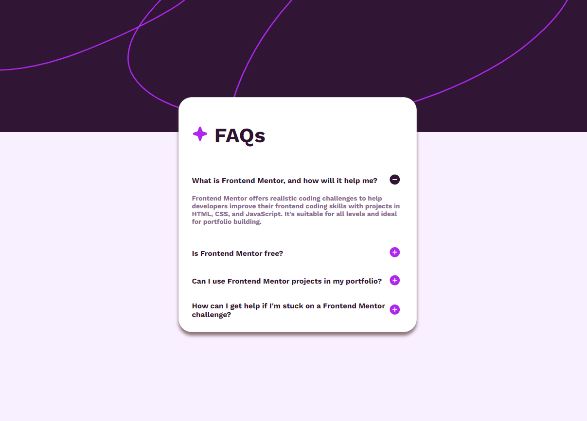

# Frontend Mentor - FAQ accordion solution

This is a solution to the [FAQ accordion challenge on Frontend Mentor](https://www.frontendmentor.io/challenges/faq-accordion-wyfFdeBwBz). Frontend Mentor challenges help you improve your coding skills by building realistic projects. 

## Table of contents

- [Overview](#overview)
  - [The challenge](#the-challenge)
  - [Screenshot](#screenshot)				
  - [Links](#links)
- [My process](#my-process)
  - [Built with](#built-with)
  - [What I learned](#what-i-learned)
  - [Continued development](#continued-development))
- [Author](#author)


## Overview

### The challenge

Users should be able to:

- Hide/Show the answer to a question when the question is clicked
- Navigate the questions and hide/show answers using keyboard navigation alone
- View the optimal layout for the interface depending on their device's screen size
- See hover and focus states for all interactive elements on the page

### Screenshot



### Links

- Solution URL: [solution URL](https://www.frontendmentor.io/solutions/faq-accordion-using-array-in-js-QvaCJyvtJe)
- Live Site URL: [live site](https://lenzhy.github.io/faq-accordion-main/)

## My process

### Built with

- Semantic HTML5 markup
- CSS custom properties
- Flexbox
- Mobile-first workflow
- [Next.js](https://nextjs.org/) - React framework


### What I learned

I learn how to use an array and how to navigate in it to reduce the size of my code and avoid repetition.

To see how you can add code snippets, see below:

```html
 <div class="QA" >
        <div class="question"> <h2>What is Frontend Mentor, and how will it help me? </h2>
          <button id="buttonPlus1" class="plusButton"> </button>
          <button id="buttonMoins1" class="plusButton"> </button>
        </div>
        <p id="text1">  Frontend Mentor offers realistic coding challenges to help developers improve their
        frontend coding skills with projects in HTML, CSS, and JavaScript. It's suitable for
        all levels and ideal for portfolio building.</p>
    </div>
```

```js
 buttonsPlus.forEach((button, index) => {                   //go through the array once to add the eventlistener
        button.addEventListener("click", () => handlePlusButtonClick(index));       //add event when click the button
    });
}
```


### Continued development

I want to use more array in the futur and be more confortable with index and function.


## Author

Frontend mentor - [@lenzhy](https://www.frontendmentor.io/profile/Lenzhy)
